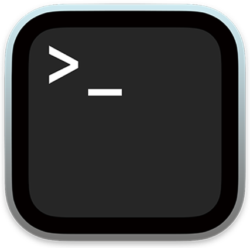
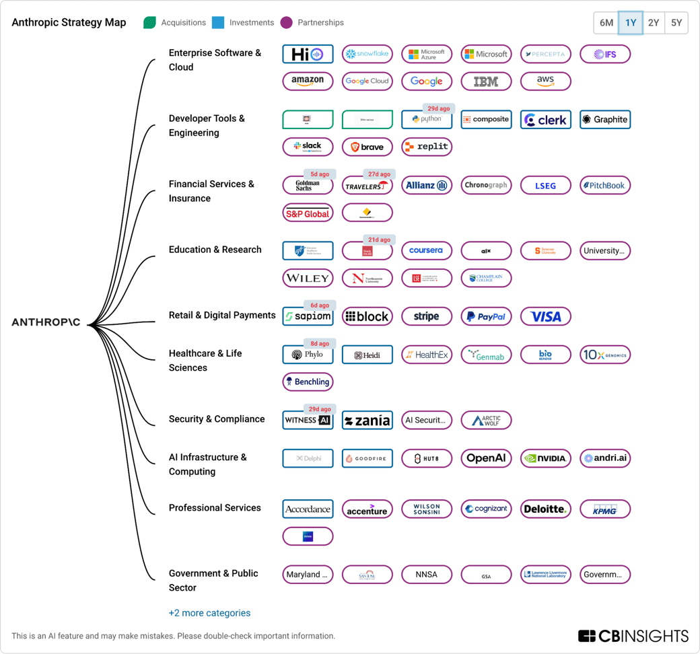
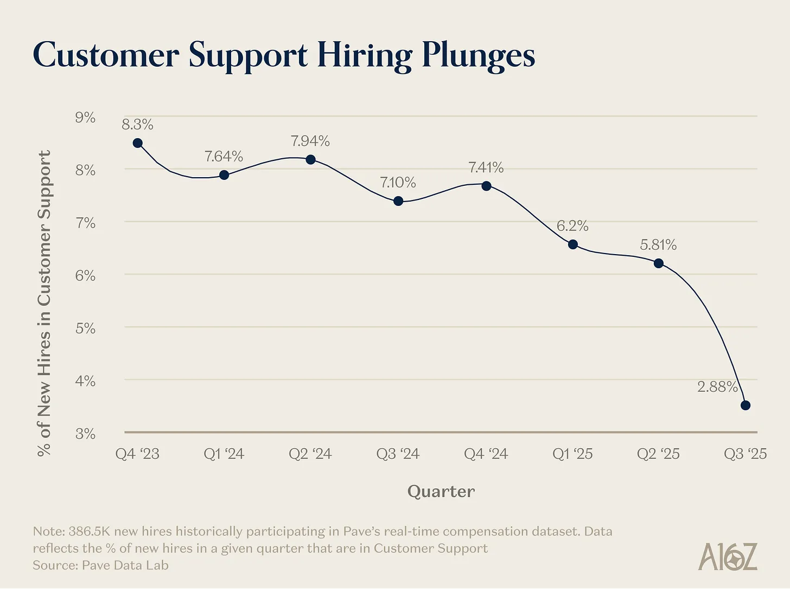

# Nemotron Nano 2 VL As A Multimodal Agentic Tool — When Vision Meets Decision-Making

## From Reading Invoices To Enforcing Policy: The Agentic Architecture Shift

Last time, Nemotron read invoices. It summed totals, detected duplicates, and showed its reasoning. Impressive — but it was a single model answering questions.

This time, Nemotron makes decisions about them. Or rather, it provides the visual intelligence that **another model uses to make decisions**. That is the shift.

---

### The Architecture Shift

In the [previous blog](nemotron-invoice-understanding-blog.md), we called Nemotron directly. One model, one API call, one answer. That works for document understanding in isolation. But real business processes are not isolated — they involve **rules, policies, multi-step reasoning, and judgment calls**.

Consider expense management. A finance team does not just read invoices — they check them against policy. Is this vendor approved? Does the amount exceed limits? Are entertainment expenses being submitted as business meals? These are **decision chains**, not single queries.

This is where the agentic pattern comes in.

> **The LLM that reads the invoice is NOT the same LLM that makes the decision. Divide the labor. Specialize.**

Here is the architecture:

```
User: "Review these invoices against our expense policy"
                    |
                    v
         +---------------------+
         |   Grok 3 Fast       |  <-- Orchestrator (cheap, fast, reasons well)
         |   (LangGraph Agent) |
         +----------+----------+
                    | calls tool per invoice
                    v
         +---------------------+
         |  Nemotron Nano 2 VL |  <-- Vision specialist (reads documents)
         |  (LangChain @tool)  |
         +----------+----------+
                    |
                    v
         Agent chains vision output -> policy check -> approve/reject
```

Two models. Two jobs. **Grok orchestrates. Nemotron analyzes.** The agent decides when to call the vision model, what to ask it, and how to interpret the results against business rules.

---

### Why Two Models Beat One

I think this is an important pattern to understand. You could send the invoice images directly to a large multimodal model and ask it to both read the documents AND enforce the policy. It would probably work. But there are three reasons to separate the roles:

**1. Cost efficiency.** Nemotron Nano 2 VL is a 12B model — small, fast, specialized for vision. You do not need a 400B model to read an invoice. Use the smallest model that does the job well, and reserve the orchestrator for reasoning and decision-making.

**2. Data sovereignty.** Nemotron can run locally on NVIDIA hardware, air-gapped from the internet. Your sensitive invoices never leave the building. The orchestrator (Grok in this case) only sees extracted text — vendor names, amounts, line items — never the raw document images.

**3. Swappable components.** The vision model is a tool. If NVIDIA releases Nemotron Nano 3 tomorrow, you swap one line of code. The agent logic stays the same. If you want to switch the orchestrator from Grok to Claude to GPT, the tool stays the same. **Loose coupling is good engineering.**

---

### The Demo: Expense Policy Enforcement

I built an expense policy enforcement agent. The setup:

- **Orchestrator**: Grok 3 Fast via LangGraph ReAct agent
- **Vision tool**: Nemotron Nano 2 VL via NVIDIA API, wrapped as a LangChain `@tool`
- **Policy**: Hardcoded rules (meal limit $75, no entertainment/gaming, itemization above $500)
- **Task**: Review 3 invoices, check each against policy, approve or reject

The invoices come from the same [HuggingFace dataset](https://huggingface.co/datasets/katanaml-org/invoices-donut-data-v1) used in the previous blog. Three invoices, each with different vendors, line items, and totals.

Here is what happens when you run it:

1. The agent receives the expense policy and the instruction to review 3 invoices
2. For **each invoice**, the agent calls `analyze_invoice_image` — this sends the image to Nemotron
3. Nemotron reads the raw invoice image and returns: vendor name, date, line items, totals
4. The agent checks the extracted data against every policy rule
5. After all 3 invoices, the agent produces a summary table with APPROVED/REJECTED per invoice

The agent correctly identifies policy violations. An invoice containing gaming consoles gets flagged as a prohibited entertainment/gaming purchase — exactly what the policy forbids.

> **The agent does not just read documents. It enforces business rules against visual evidence.**

---

### The Code



The entire demo is ~150 lines. Here are the key pieces.

**The Nemotron tool** — a standard LangChain `@tool` that wraps the NVIDIA API call:

```python
@tool
def analyze_invoice_image(invoice_index: int, query: str) -> str:
    """Analyze an invoice image using Nemotron Nano 2 VL vision model.

    Use this tool to read and extract information from invoice images.
    Available invoice indices: 6, 8, 10.
    """
    image_url = invoice_images[invoice_index]

    messages = [
        {"role": "system", "content": "/no_think"},
        {"role": "user", "content": [
            {"type": "image_url", "image_url": {"url": image_url}},
            {"type": "text", "text": query},
        ]},
    ]

    full_response = ""
    chat_response = nemotron_client.chat.completions.create(
        model="nvidia/nemotron-nano-12b-v2-vl",
        messages=messages,
        max_tokens=4096,
        temperature=0.6,
        stream=True,
    )

    for chunk in chat_response:
        if chunk.choices[0].delta.content is not None:
            full_response += chunk.choices[0].delta.content

    return full_response
```

Notice `/no_think` mode. When Nemotron acts as a tool inside an agent, we do not need its chain-of-thought reasoning — we just need the extracted data. The orchestrator (Grok) handles the reasoning. This also keeps token usage down.

**The agent setup** — three lines:

```python
from langgraph.prebuilt import create_react_agent

llm = ChatOpenAI(
    model="grok-3-fast",
    api_key=GROK_API_KEY,
    base_url="https://api.x.ai/v1",
)

agent = create_react_agent(
    model=llm,
    tools=[analyze_invoice_image],
)
```

That is it. LangGraph's `create_react_agent` wires together the reasoning loop: the LLM decides which tool to call, receives the result, and continues reasoning until it has enough information to answer.

**The expense policy** — a string constant the agent receives in its prompt:

```python
EXPENSE_POLICY = """
COMPANY EXPENSE POLICY
======================
1. Meal expenses must not exceed $75 per person per meal.
2. Entertainment and gaming purchases are PROHIBITED.
3. Any single invoice above $500 must include itemized line items.
4. Office supplies and standard business materials are approved up to $5,000.
5. All invoices must include: vendor name, date, itemized list, and total amount.
"""
```

The agent receives this policy alongside instructions to review each invoice, extract details via the vision tool, and check compliance.

---

### The Pattern In Context

This is not an academic exercise. Look at where enterprise AI investment is flowing:


*Source: CB Insights. Goldman Sachs, Deloitte, KPMG, Allianz — all investing in AI for financial operations.*

Goldman Sachs is not investing in chatbots. They are investing in systems that can **read financial documents, apply business rules, and make compliance decisions at scale**. The architecture I showed here — a fast orchestrator that delegates visual understanding to a specialized model — is exactly the pattern these companies are building toward.

The A16Z data tells the same story from the other direction:


*Customer support hiring as a percentage of new hires dropped from 8.3% to 2.88%. Document processing roles are next.*

Customer support was the first wave. **Document processing, invoice review, and compliance auditing are the next wave.** The models are ready. The agentic frameworks are ready. The pattern works.

---

### What This Tells Us

Three things stand out:

**1. Specialized models as agentic tools is the next phase.** We have moved from "one model does everything" to "the right model for the right job, orchestrated by an agent." Nemotron reads documents. Grok reasons about policy. Each model does what it is best at. This is how enterprise AI systems will be built — not monolithic, but composed.

**2. The @tool decorator is the new API.** In the previous blog, calling Nemotron required building message payloads, managing streaming, handling base64 encoding. In the agentic version, all of that is wrapped behind a `@tool` decorator. The agent calls `analyze_invoice_image(invoice_index=6, query="...")` and gets back text. **The complexity is encapsulated. The interface is clean.**

**3. Data sovereignty and agentic AI are compatible.** Nemotron runs locally on NVIDIA hardware. The agent only sends extracted text to the orchestrator — never raw images. This means you can build agentic workflows where **sensitive documents never leave your infrastructure**, while still leveraging cloud-hosted models for orchestration and reasoning. Best of both worlds.

> **The vision model reads. The orchestrator decides. The policy is enforced. 150 lines of Python.**

---

### Running The Demo

```bash
pip install langchain-openai langgraph openai pyarrow pandas Pillow certifi
export NVIDIA_API_KEY="your-key"   # Free at build.nvidia.com
export GROK_API_KEY="your-key"     # From x.ai
python3 nemotron_agentic_tool_demo.py
```

The agent will make 3 tool calls (one per invoice), and print a final summary with APPROVED/REJECTED per invoice.

---

Follow me on [LinkedIn](https://www.linkedin.com/in/cobusgreyling) for more on Agentic AI, LLMs and NLP.
