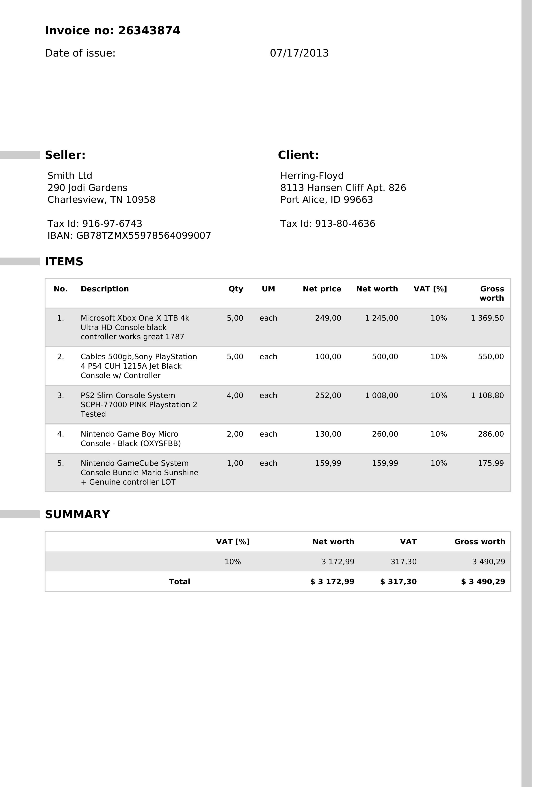
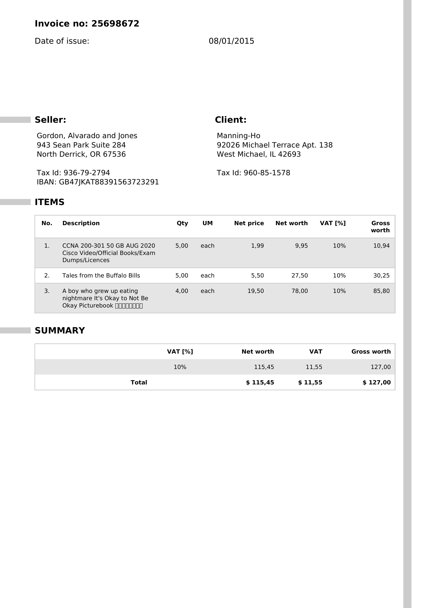
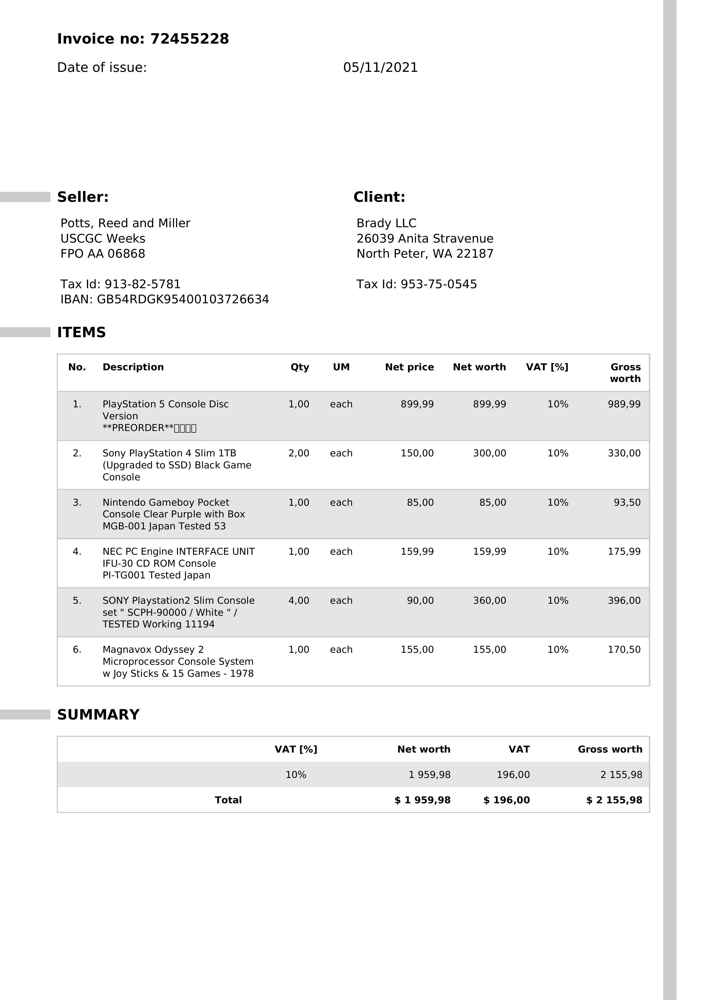
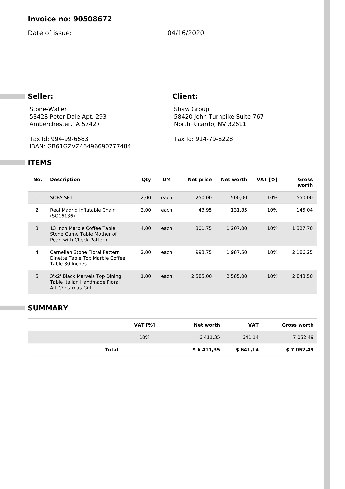

# NVIDIA Nemotron For Invoice Understanding — Deep Research Meets Internal Audit

## A Practical Example Of Using A Vision Language Model For Fraud Detection And Document Intelligence

Nemotron from NVIDIA is a set of highly capable models, data and frameworks. These are tools designed to leverage NVIDIA's hardware stack — and the results are impressive.

What I want to show here is a practical, working example of how the **Nemotron Nano 2 VL** model can be used for something that matters in the real world: **invoice understanding, audit and duplicate detection**.

---

### Why This Matters

I think what excites me most about this example is not the technology itself, but what it represents.

Most conversations about AI focus on chatbots, code generation, or content creation. But the **deep research capabilities of AI** have a far more transformative application: **internal audits and fraud detection** within companies.

The data already tells the story. Look at what is happening to customer support hiring:


*Source: Pave Data Lab via A16Z. Customer support hiring as a percentage of new hires has dropped from 8.3% in Q4 2023 to 2.88% in Q3 2025.*

This is not a small dip — it is a cliff. AI is already replacing operational roles at scale. Customer support is just the most visible example. **The same pattern is coming for manual document processing, invoice review, and financial auditing.** The question is not whether AI will handle these tasks, but which models and architectures will do it best.

Consider what happens today when a finance team needs to audit invoices:

- Manual review of thousands of documents
- Human eyes scanning for duplicates, inconsistencies, anomalies
- Hours of repetitive work that is error-prone and expensive

A Vision Language Model like Nemotron changes this fundamentally. You feed it invoice images — not structured data, not OCR output, but the **raw document images** — and it reasons about them.

> **The model reads the invoices like a human would, but at scale and with reasoning that can be toggled on and off.**

---

### The Enterprise AI Landscape

This is not happening in isolation. Every major AI company is investing heavily in financial services and enterprise operations. Look at the Anthropic strategy map:


*Source: CB Insights. Anthropic's partnerships and investments span Financial Services & Insurance (Goldman Sachs, Travelers, Allianz, S&P Global), Professional Services (Accenture, Deloitte, KPMG), and Government.*

Goldman Sachs. Allianz. S&P Global. Deloitte. KPMG. These are not companies experimenting with chatbots — they are integrating AI into core financial operations. **Invoice processing, claims review, compliance auditing — this is where the real value is being created.**

NVIDIA sits in the same ecosystem (visible under AI Infrastructure & Computing in the map above), and Nemotron is their answer for document intelligence that can run on-premise with full data sovereignty.

---

### Nemotron Nano 2 VL — What It Is

Nemotron Nano 2 VL is a 12B parameter open Vision Language Model from NVIDIA. Key characteristics:

- **Multimodal** — processes both images and text
- **Reasoning toggle** — you can turn chain-of-thought reasoning on (`/think`) or off (`/no_think`) depending on the task
- **Document intelligence** — reads invoices, receipts, PDFs, charts
- **Video understanding** — processes video content with efficient video sampling
- **Open model** — available for local deployment

That last point is important. **Nemotron is ideal if you want to run offline to achieve full data and model sovereignty.** For companies handling sensitive financial documents, the ability to run the model on-premise — without any data leaving the building — is not a nice-to-have. It is a requirement.

---

### The Practical Example

I loaded four invoice images from a [HuggingFace dataset](https://huggingface.co/datasets/katanaml-org/invoices-donut-data-v1) and ran two queries against the Nemotron model.

Here are the four invoices the model was given — raw images, no pre-processing, no OCR:

| Invoice 1 | Invoice 2 |
|:-:|:-:|
|  |  |

| Invoice 3 | Invoice 4 |
|:-:|:-:|
|  |  |

Each invoice has a different seller, different line items, different dates, and different totals. The model needs to read and reason about all four simultaneously.

#### Query 1 — Sum Up All The Totals Across The Receipts

The model was given four invoice images and asked to sum the totals.

```python
text_prompt = "Sum up all the totals across the reciepts."
reasoning_mode = True
temperature = 0.6
```

**The model's reasoning:**

The model identified the "Gross worth" from each invoice:

| Invoice | Seller | Gross Worth |
|---------|--------|-------------|
| 1 | Smith Ltd | $3,490.29 |
| 2 | Gordon, Alvarado and Jones | $127.00 |
| 3 | Potts, Reed and Miller | $2,155.98 |
| 4 | Stone-Waller | $7,052.49 |

It then performed step-by-step arithmetic:

```
$3,490.29 + $127.00 = $3,617.29
$3,617.29 + $2,155.98 = $5,773.27
$5,773.27 + $7,052.49 = $12,825.76
```

**Answer: $12,825.76**

What I find remarkable here is that the model extracted financial figures from these raw invoice images — not OCR, not structured data — and performed multi-step arithmetic with reasoning visible at every step. Look at [invoice_1.png](invoice_1.png) for example — the model correctly identified the $3,490.29 gross worth from a dense, multi-line document. This is auditable AI.

---

#### Query 2 — Duplicate Invoice Detection

The same four invoices were flagged as potential duplicates:

```python
text_prompt = "Here are 4 invoices flagged as potential duplicates — are they actually the same document with minor layout differences?"
reasoning_mode = True
temperature = 0.6
```

**The model's reasoning:**

The model systematically compared each invoice across multiple dimensions:

- **Dates**: 2013, 2015, 2021, 2020 — all different
- **Sellers**: Smith Ltd, Gordon/Alvarado/Jones, Potts/Reed/Miller, Stone-Waller — all different
- **Items**: Gaming consoles vs books vs furniture — distinct product categories
- **Totals**: $3,490 vs $127 vs $2,155 vs $7,052 — all different amounts

**Answer: No, these are not duplicates.** The layout similarities (items section, VAT percentage) are standard invoice formatting, but the content confirms they are separate documents.

This is exactly the kind of reasoning you need in a financial audit. The model did not just do a pixel comparison — it **understood the semantic content** of each document and compared them across meaningful dimensions.

---

### The Code


The full demo runs from a single Python script. It downloads invoices from HuggingFace, encodes them as base64 images, and sends them to the Nemotron model via NVIDIA's OpenAI-compatible API.

```python
from openai import OpenAI
from PIL import Image
import pyarrow.parquet as pq
import io, base64

# Connect to NVIDIA API (or run locally for sovereignty)
client = OpenAI(
    base_url="https://integrate.api.nvidia.com/v1",
    api_key="YOUR_NVIDIA_API_KEY",
)

def encode_pil_to_jpeg_data_url(pil_image):
    pil_image = pil_image.convert("RGB")
    buf = io.BytesIO()
    pil_image.save(buf, format="JPEG")
    b64 = base64.b64encode(buf.getvalue()).decode("utf-8")
    return f"data:image/jpeg;base64,{b64}"

def call_nemotron(image_urls, text_prompt, reasoning=True):
    messages = [
        {"role": "system", "content": "/think" if reasoning else "/no_think"},
        {"role": "user", "content": [
            *[{"type": "image_url", "image_url": {"url": url}} for url in image_urls],
            {"type": "text", "text": text_prompt},
        ]},
    ]
    response = client.chat.completions.create(
        model="nvidia/nemotron-nano-12b-v2-vl",
        messages=messages,
        max_tokens=32000,
        temperature=0.6,
        stream=True,
    )
    for chunk in response:
        reasoning_content = getattr(chunk.choices[0].delta, "reasoning_content", None)
        if reasoning_content:
            print(reasoning_content, end="")
        if chunk.choices[0].delta.content:
            print(chunk.choices[0].delta.content, end="")

# Load invoices from HuggingFace
table = pq.read_table("invoices.parquet")
df = table.to_pandas()

image_urls = []
for idx in [6, 8, 10, 12]:
    img = Image.open(io.BytesIO(df.loc[idx, "image"]["bytes"]))
    image_urls.append(encode_pil_to_jpeg_data_url(img))

# Query 1: Sum totals
call_nemotron(image_urls, "Sum up all the totals across the reciepts.")

# Query 2: Duplicate detection
call_nemotron(image_urls, "Here are 4 invoices flagged as potential duplicates — are they actually the same document with minor layout differences?")
```

---

### What This Tells Us

Three things stand out to me:

**1. Deep research capabilities applied to internal operations.** We talk a lot about AI for customer-facing use cases. But the deep reasoning capabilities of models like Nemotron are arguably more valuable for **internal audit, compliance, and fraud detection**. A model that can read, reason about, and compare thousands of invoices is a force multiplier for finance teams. The A16Z data on customer support hiring is a leading indicator — the same displacement is coming for manual document review.

**2. Reasoning transparency matters.** The `/think` mode shows the model's chain of thought — every step of the arithmetic, every comparison made. This is not a black box. For audit and compliance, this **inspectability** is essential. When Goldman Sachs or Deloitte integrates AI into financial workflows, they need to show regulators how the model arrived at its conclusions. Nemotron's reasoning toggle makes this possible.

**3. Data sovereignty is achievable.** Nemotron is an open model. You can run it on NVIDIA hardware on-premise, air-gapped from the internet. For companies in regulated industries — finance, healthcare, government — this means you get the capabilities of a frontier Vision Language Model **without your data ever leaving your infrastructure**. This is why NVIDIA's approach matters: the model runs where your data lives.

> **Nemotron is not just a model. It is NVIDIA's toolkit for making AI practical on their hardware — and invoice understanding is one of many applications where it shines.**

I think we are going to see a lot more of this pattern: **frontier AI capabilities applied to mundane but critical business processes** like invoice auditing, claims processing, and compliance checks. The hiring data shows the shift is already happening. The enterprise partnerships show the investment is already flowing. The models are ready. The use cases are waiting.

Follow me on [LinkedIn](https://www.linkedin.com/in/cobusgreyling) for more on Agentic AI, LLMs and NLP.
